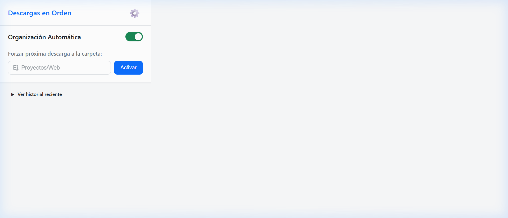
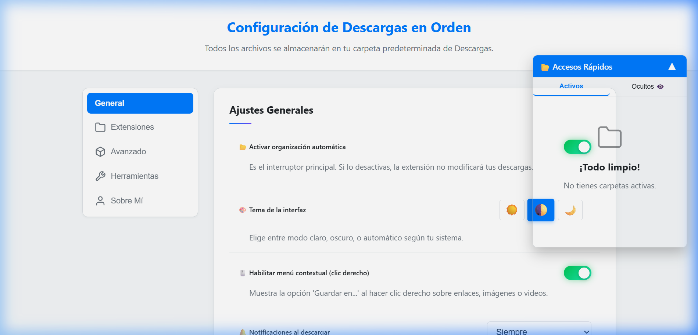
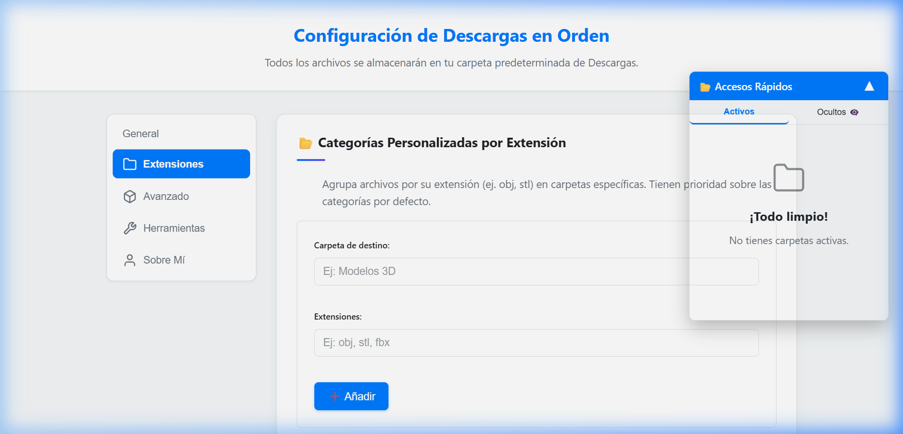
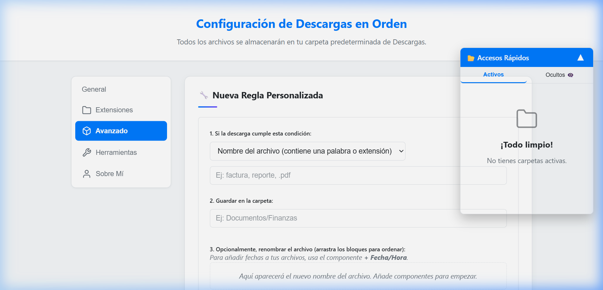
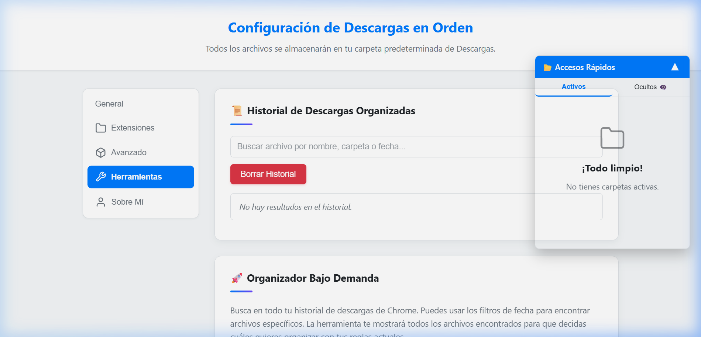
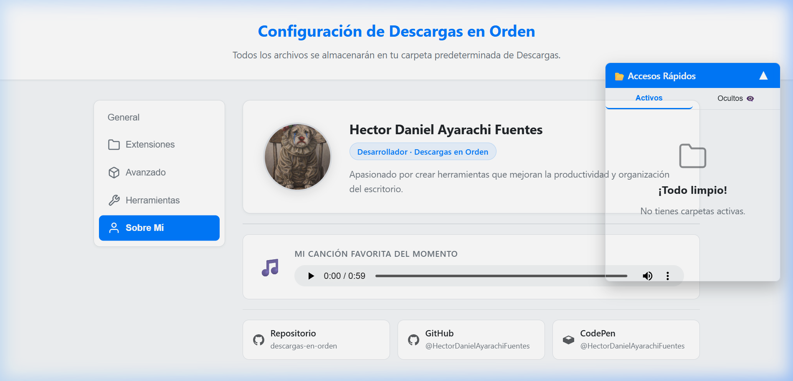

<div align="center">

# 📂 Descargas en Orden

**Organiza automáticamente tus descargas en carpetas específicas dentro de tu carpeta de Descargas.**

[](https://github.com/HectorDanielAyarachiFuentes/descargas-en-orden)
[](https://github.com/HectorDanielAyarachiFuentes/descargas-en-orden)
[](LICENSE)

</div>

---

## 🚀 ¿Qué es Descargas en Orden?

**Descargas en Orden** es una extensión para Google Chrome (y navegadores basados en Chromium) que organiza automáticamente cada archivo que descargas, enviándolo a una subcarpeta dentro de tu carpeta de Descargas según reglas que vos mismo definís.

¿Cansado de que todos tus archivos aparezcan mezclados en la carpeta Descargas? Esta extensión los ordena por ti, sin que tengas que hacer nada extra.

---

## ✨ Funcionalidades Principales

| Función | Descripción |
|---|---|
| 🤖 **Organización Automática** | Cada descarga se mueve automáticamente a la carpeta correcta según las reglas configuradas |
| 📂 **Categorías Predeterminadas** | Separa automáticamente PDFs, Imágenes, Videos, Audio, Comprimidos, Documentos, etc. |
| 🔧 **Reglas Personalizadas** | Crea reglas basadas en el nombre del archivo o la URL de origen |
| 🗂️ **Categorías por Extensión** | Agrupa tipos de archivo específicos (ej: `.stl`, `.obj`) en carpetas propias |
| ✏️ **Renombrado Automático** | Renombra los archivos al descargarlos usando componentes como texto libre, nombre original, sitio web o fecha/hora |
| 🖱️ **Menú Contextual** | Clic derecho sobre cualquier enlace o imagen para elegir la carpeta de destino al instante |
| ⚡ **Modo Forzado** | Fuerza que la próxima descarga vaya a una carpeta específica con un solo clic en el popup |
| 🔍 **Organizador Bajo Demanda** | Busca en tu historial de Chrome y organiza archivos descargados en el pasado |
| 📜 **Historial de Descargas** | Registra todas las descargas organizadas con acceso rápido para abrir la carpeta o re-descargar |
| 🔔 **Notificaciones** | Recibe avisos de escritorio cuando una descarga es organizada (configurable) |
| 💡 **Sugerencias Inteligentes** | Detecta patrones de descarga y te sugiere crear reglas automáticamente |
| 🎨 **Temas** | Interfaz con modo claro, oscuro y automático (según el sistema) |
| 📤 **Exportar / Importar Reglas** | Guarda y restaura todas tus reglas en un archivo JSON |
| 🖥️ **Widget de Acceso Rápido** | Panel flotante que muestra tus carpetas de descarga con acceso rápido |

---

## 📸 Capturas de Pantalla

### Popup Rápido (desde la barra de herramientas)

> Al hacer clic en el ícono de la extensión, se abre el popup con el estado actual, historial reciente y la opción de forzar la carpeta de la próxima descarga.



---

### ⚙️ Ajustes Generales

> Pestaña principal de configuración. Permite activar/desactivar la organización automática, elegir el tema de interfaz, habilitar el menú contextual y configurar las notificaciones. También se muestra la selección de **Categorías Automáticas** (PDFs, Imágenes, Videos, etc.).



---

### 📂 Categorías por Extensión de Archivo

> Permite crear grupos de extensiones personalizadas que se envían a carpetas específicas. Ideal para extensiones de nicho como `.stl`, `.fbx`, `.obj` (modelado 3D) u otras que no están en las categorías estándar.



---

### 🔧 Reglas Personalizadas Avanzadas

> El constructor de reglas avanzadas permite definir condiciones basadas en el **nombre del archivo** o la **URL de origen**. Además, incluye un editor de renombrado con componentes arrastrables: texto libre, nombre original, sitio web y fecha/hora con formato personalizable.



---

### 🛠️ Herramientas e Historial

> Incluye el **historial completo** de todas las descargas organizadas (con búsqueda por nombre, carpeta o fecha) y el **Organizador Bajo Demanda**: busca en el historial de Chrome para organizar archivos descargados en el pasado, con filtros de fecha y opción de análisis profundo.



---

### 👤 Sobre el Desarrollador

> Sección informativa sobre el autor de la extensión con links al repositorio, GitHub y CodePen.



---

## 🛠️ Instalación

### Desde el Chrome Web Store
> *(Próximamente disponible)*

### Instalación Manual (para desarrollo)

1. Clona o descarga este repositorio:
   ```bash
   git clone https://github.com/HectorDanielAyarachiFuentes/descargas-en-orden.git
   ```
2. Abre Google Chrome y navega a `chrome://extensions/`
3. Activa el **Modo desarrollador** (toggle en la esquina superior derecha)
4. Haz clic en **"Cargar descomprimida"**
5. Selecciona la carpeta del proyecto
6. ¡Listo! El ícono de la extensión aparecerá en la barra de herramientas

---

## 📖 Cómo Usarla

### Uso Básico (Automático)
Una vez instalada, la extensión funciona en segundo plano. **Cada archivo que descargues** será automáticamente movido a la subcarpeta correspondiente dentro de tu carpeta de Descargas.

### Crear una Regla Personalizada
1. Haz clic en el ícono de la extensión → botón ⚙️ **Configuración**
2. Ve a la pestaña **Avanzado**
3. Define la condición (ej: el nombre contiene `"factura"`)
4. Indica la carpeta de destino (ej: `Documentos/Finanzas`)
5. Opcionalmente, configura el renombrado automático
6. Haz clic en **✨ Guardar Nueva Regla**

### Forzar la Carpeta de la Próxima Descarga
1. Haz clic en el ícono de la extensión
2. Escribe el nombre de la carpeta en el campo **"Forzar próxima descarga a..."**
3. Haz clic en **Activar**
4. La próxima descarga irá a esa carpeta, y el modo se desactiva automáticamente

### Organizar Descargas Pasadas
1. Ve a **Configuración** → pestaña **Herramientas**
2. En la sección **🚀 Organizador Bajo Demanda**, usa los filtros de fecha
3. Haz clic en **🔍 Buscar Archivos en Historial**
4. Selecciona los archivos que quieras organizar y haz clic en **✨ Organizar Seleccionados**

---

## 🏗️ Arquitectura del Proyecto

```
descargas-en-orden/
├── manifest.json          # Configuración de la extensión (Manifest V3)
├── background.js          # Service Worker: lógica principal de organización
├── popup.html             # UI del popup rápido
├── popup.js               # Lógica del popup
├── options.html           # Página de configuración completa
├── options.js             # Lógica de la página de opciones
├── theme-manager.js       # Gestor de temas (claro/oscuro/auto)
├── welcome.html           # Página de bienvenida (primera instalación)
├── welcome.js             # Lógica de la página de bienvenida
├── css/
│   ├── options.css        # Estilos de la página de opciones
│   └── popup.css          # Estilos del popup
├── _locales/
│   └── es/messages.json   # Internacionalización (i18n) en español
├── libs/
│   └── Sortable.min.js    # Librería para drag & drop de reglas
└── Sobre Mi/              # Assets de la sección "Sobre el Desarrollador"
```

### Permisos Requeridos

| Permiso | Razón |
|---|---|
| `downloads` | Interceptar y mover archivos descargados |
| `storage` | Guardar reglas y configuración del usuario |
| `notifications` | Mostrar notificaciones de escritorio |
| `contextMenus` | Añadir opción "Guardar en..." al menú de clic derecho |
| `tabs` | Detectar el sitio de origen de la descarga para reglas por URL |

---

## 📝 Orden de Prioridad de Reglas

Cuando un archivo descargado coincide con múltiples condiciones, se aplica el siguiente orden de prioridad:

1. **Modo Forzado** (máxima prioridad)
2. **Menú Contextual** (elegido manualmente por el usuario)
3. **Reglas Personalizadas Avanzadas** (en orden de aparición en la lista, arrastrables)
4. **Categorías por Extensión Personalizadas**
5. **Categorías Automáticas por Defecto** (PDF, Imagen, Video, etc.)

---

## 🙋 Sobre el Autor

Desarrollado con ❤️ por **Hector Daniel Ayarachi Fuentes**

- **GitHub:** [@HectorDanielAyarachiFuentes](https://github.com/HectorDanielAyarachiFuentes)
- **Repositorio:** [descargas-en-orden](https://github.com/HectorDanielAyarachiFuentes/descargas-en-orden)
- **CodePen:** [@HectorDanielAyarachiFuentes](https://codepen.io/HectorDanielAyarachiFuentes)

---

<div align="center">
  <sub>© 2025 - Descargas en Orden</sub>
</div>
